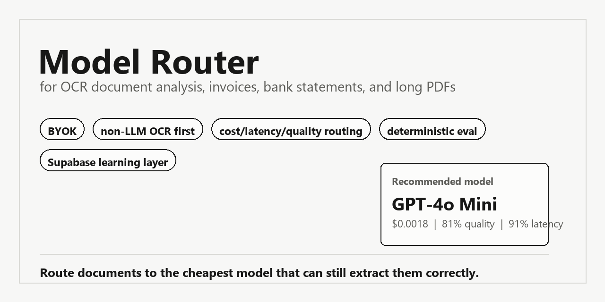

# Model Router for OCR Document Analysis

Route OCR, PDF parsing, invoice extraction, bank statement extraction, and long-document analysis jobs to the cheapest AI model that can still do the work correctly.

**DocRouter** is a BYOK model router for OCR document analysis: invoices, bank statements, scanned PDFs, table-heavy forms, and long financial documents. It runs non-LLM OCR first, profiles the document, ranks the user's enabled models by cost, quality, latency, and document difficulty, then records deterministic evaluation feedback for a learning layer.

It is not a general-purpose chatbot router. It is built for OCR and structured extraction.



## Demo

Watch the local V2 workflow: preset extraction fields, model ranking, readable extracted output, and deterministic eval.

[Download the MP4 demo](docs/assets/docrouter-demo.mp4)

The demo can be regenerated:

```bash
python scripts/create-demo-video.py
python scripts/create-social-preview.py
```

## Why This Exists

Document AI stacks usually choose one of two bad defaults:

- Always use the strongest model, which wastes money on simple PDFs.
- Always use the cheapest model, which breaks on dense statements, tables, scans, and reconciliation-heavy documents.

This OCR document analysis model router sits before the model call. It asks: based on this document's OCR profile, layout, page count, table density, requested fields, latency target, and cost policy, which model should run this extraction?

## What It Does

- Runs non-LLM OCR/preflight before any model call.
- Supports invoices, bank statements, receipts, tax forms, contracts, loan docs, financial reports, scanned images, and long PDFs.
- Lets each user bring their own model API keys during onboarding.
- Stores user model preferences and encrypted provider credentials.
- Ranks commercial and open-source/self-hosted models.
- Explains routing math: estimated tokens, cost, quality, latency, difficulty, and final score.
- Shows extracted output as readable fields and tables, not just raw JSON.
- Runs deterministic eval checks for required fields, totals, transactions, and reconciliation.
- Records clicks, decisions, feedback, model outcomes, document fingerprints, and learning signals in Supabase-ready tables.

## Quick Start

```bash
npm install
npm run build

# PowerShell
$env:TRANSPORT="http"; $env:PORT="3100"; node dist/index.js

# macOS/Linux
TRANSPORT=http PORT=3100 node dist/index.js
```

Open:

- V2 BYOK learning workflow: `http://localhost:3100/v2.html`
- Demo recording mode: `http://localhost:3100/v2.html?demo=1`
- V1 routing dashboard: `http://localhost:3100/dashboard.html`
- Health check: `http://localhost:3100/health`

Run checks:

```bash
npm test
```

## Product Flow


## Routing Logic

The router does not use an AI to choose an AI. It uses deterministic scoring:

- Document type: bank statement, invoice, long PDF, table-heavy scan, etc.
- Page count and character count.
- Text layer quality: good, partial, poor, none.
- Image quality and handwriting flags.
- Layout complexity and table density.
- Financial validation needs: totals, transactions, reconciliation.
- User policy: balanced, quality, cost, or latency.
- User's enabled models and available provider keys.
- Learned user/global model outcomes from deterministic eval and feedback.

The final score blends model quality, estimated cost, expected latency, task fit, document difficulty, and learned score. Every ranked row has an **Explain** button that shows the math.

## V2 BYOK + Learning Layer

Users choose providers and models during onboarding. Their API keys are encrypted server-side and never displayed back. Extraction runs are tied to the user's selected model pool.

V2 records:

- Document profiles and OCR warnings.
- Model recommendations and selected ranks.
- Estimated cost and latency.
- Extraction instruction and requested fields.
- Provider execution or dry-run fallback.
- Rule-based eval checks.
- Happy/not-happy feedback and escalation.
- Document intelligence fingerprints for future routing improvement.

Local development writes to `.docrouter/*`. Production can mirror to Supabase using the migrations in [`supabase/migrations`](supabase/migrations).

## API Surface

| Endpoint | Purpose |
|---|---|
| `POST /api/v2/onboarding` | Save user onboarding, strategy, and enabled model pool. |
| `GET /api/v2/onboarding?user_id=...` | Load saved onboarding/model preferences. |
| `POST /api/v2/provider-credentials` | Save encrypted provider credentials. |
| `GET /api/v2/provider-credentials?session_id=...` | List credential summaries without exposing keys. |
| `POST /api/v2/extract` | Upload a document, OCR it, route it, execute/dry-run, evaluate, and log. |
| `POST /api/v2/feedback` | Record happy/not-happy feedback and update learning signals. |
| `GET /api/v2/learning?user_id=...` | Read global and user-specific learning summaries. |

## MCP Tools

| Tool | Purpose |
|---|---|
| `router_route_request` | Recommend the model before OCR/extraction/validation. |
| `router_execute_request` | Route and execute provider extraction, or dry-run without keys. |
| `router_list_models` | Browse model catalog, pricing, and capabilities. |
| `router_get_trajectory` | Inspect spend and step history for an extraction session. |
| `router_get_stats` | Aggregate routing stats and savings. |
| `router_estimate_cost` | Estimate document extraction cost across models. |
| `router_record_outcome` | Record eval feedback, validation status, latency, and cost. |
| `router_get_learned_scores` | Inspect adaptive model/task scores. |
| `v2_log_event` | Record V2 recommendations, clicks, evals, selections, and feedback. |
| `v2_evaluate_extraction` | Run deterministic rule checks on extraction JSON. |

## Environment

Start with:

```bash
cp .env.example .env
```

Important production variables:

- `TRANSPORT=http`
- `PORT=3100`
- `V2_CREDENTIAL_ENCRYPTION_KEY`
- `SUPABASE_URL`
- `SUPABASE_PUBLISHABLE_KEY`
- `SUPABASE_SERVICE_ROLE_KEY` or `SUPABASE_SECRET_KEY`
- `SUPABASE_DB_URL`
- Provider keys only for server-owned testing. In V2, end users can save their own keys during onboarding.

Never commit `.env`, `.docrouter`, uploaded documents, or local credential stores.

## Documentation

| File | Contents |
|---|---|
| [`SYSTEM.md`](SYSTEM.md) | Architecture, data flow, tool contracts, and core types. |
| [`DEVELOPMENT.md`](DEVELOPMENT.md) | Local setup, env vars, build commands, and testing. |
| [`docs/document-routing-logic.md`](docs/document-routing-logic.md) | OCR-specific lookup table and routing heuristics. |
| [`docs/testing.md`](docs/testing.md) | Manual curl and smoke-test paths. |
| [`docs/extending.md`](docs/extending.md) | Add models, policies, task types, and tools. |
| [`docs/docker.md`](docs/docker.md) | Docker and deployment notes. |
| [`docs/troubleshooting.md`](docs/troubleshooting.md) | Common errors and fixes. |

## Suggested GitHub Topics

`ocr`, `document-analysis`, `document-ai`, `llm-router`, `model-router`, `model-routing`, `pdf-extraction`, `invoice-extraction`, `bank-statement-extraction`, `bank-statements`, `financial-documents`, `supabase`, `mcp-server`, `byok`, `typescript`, `express`

## Status

This is an early product build. It includes the router, dashboard, V2 BYOK flow, deterministic eval, Supabase migrations, demo assets, and dry-run mode. Real provider extraction requires user-supplied API keys or configured server/provider credentials.

